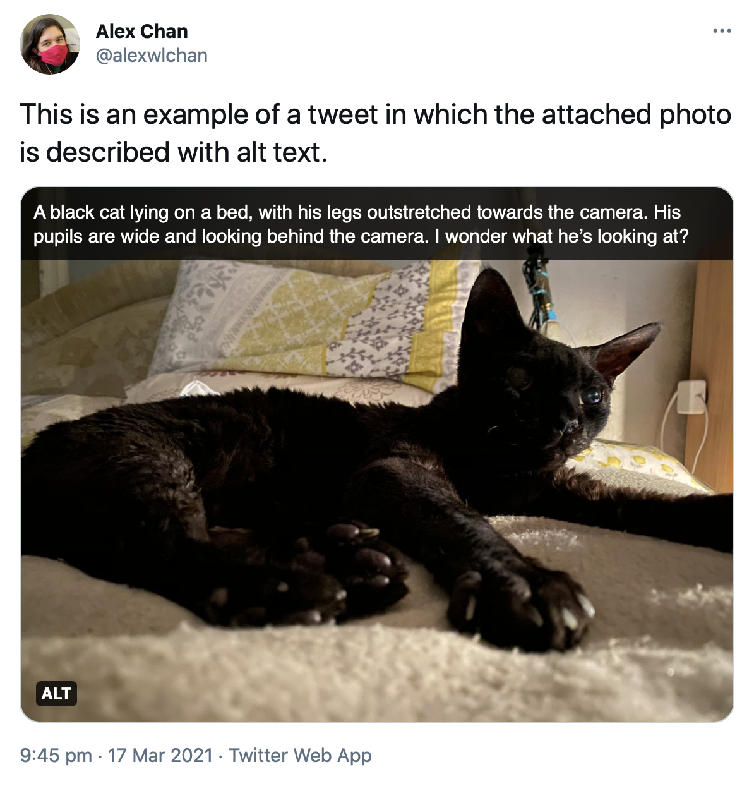
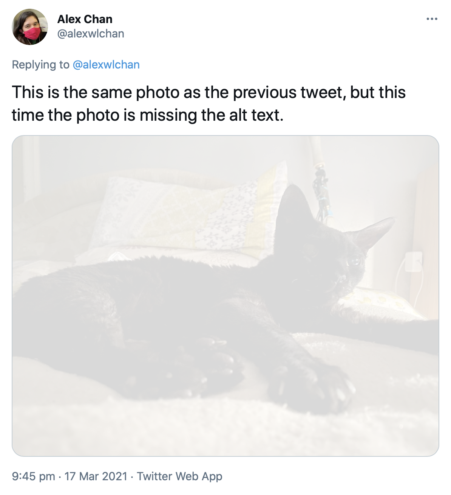

# highlight-twitter-alt-text

This repo has some tools I use to highlight the (in)accessibility of my Twitter timeline.

## Motivation

Twitter supports [adding alt text to images](https://help.twitter.com/en/using-twitter/picture-descriptions), so they're accessible to more people -- in particular, people who are blind or low-vision, who often use screen readers.

I try to remember to add alt text to every image that I post, and I'm trying not to retweet/quote tweet images that don't have alt text -- but Twitter doesn't make this easy.
The alt text isn't shown if you're not using a screen reader, so at a glance it's not obvious if a particular image does or doesn't have alt text.

This repo contains a couple of CSS and JavaScript snippets I use to make alt text more visible, or hide tweets that don't include it.

## Inspiration

I didn't come up with this idea -- I saw some tweets from [@lunasorcery](https://twitter.com/lunasorcery) and [@thingskatedid](https://twitter.com/thingskatedid) that put the idea in my head, and I created this GitHub repo so I had something I could easily link "here's how to highlight alt text on Twitter".

## Tools

First, I have a couple of CSS snippets that will highlight the presence/absence of alt text.
One adds an overlay that shows the alt text on the image, the other dims images that don't have any:

<table>
  <tr>
    <td>
      
      A tweet using <a href="add_alt_text_overlay.css"><code>add_alt_text_overlay.css</code></a>
    </td>
    <td>
      
      A tweet using <a href="dim_media_without_alt_text.css"><code>dim_media_without_alt_text.css</code></a>
    </td>
  </tr>
</table>
