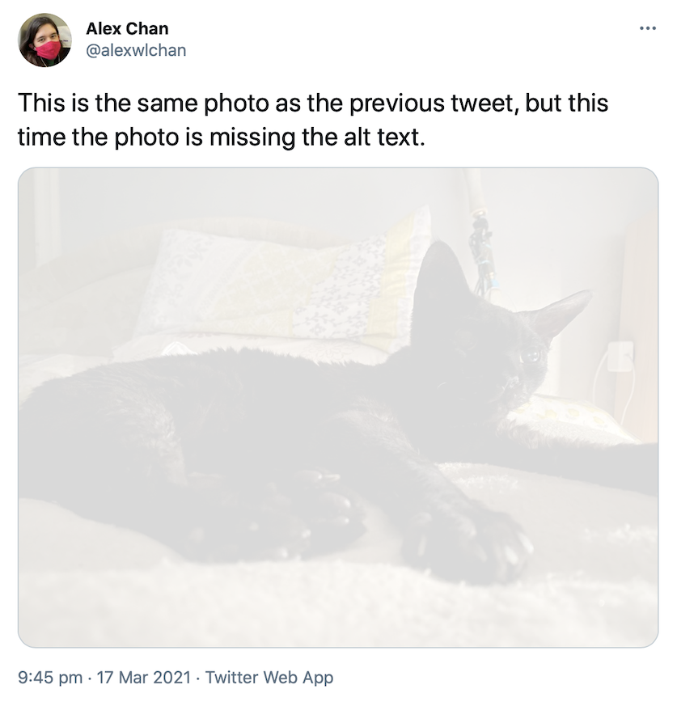
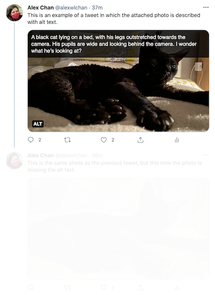
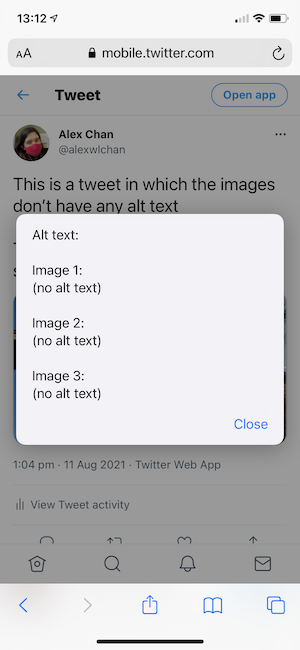
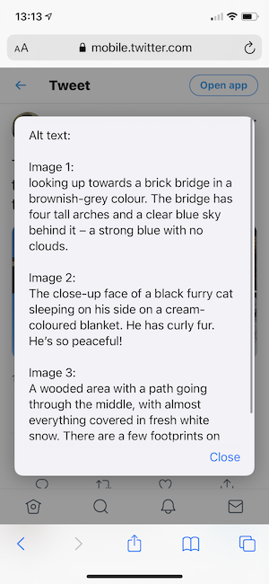

# highlight-twitter-alt-text

This repo has some tools I use to highlight the (in)accessibility of my Twitter timeline.

## Motivation

Twitter supports [adding alt text to images](https://help.twitter.com/en/using-twitter/picture-descriptions), so they're accessible to more people -- in particular, people who are blind or low-vision, who often use screen readers.

I try to remember to add alt text to every image that I post, and I'm trying not to retweet/quote tweet images that don't have alt text -- but Twitter doesn't make this easy.
The alt text isn't shown if you're not using a screen reader, so at a glance it's not obvious if a particular image does or doesn't have alt text.

This repo contains a couple of CSS and JavaScript snippets I use to make alt text more visible, or hide tweets that don't include it.

## Inspiration

I didn't come up with these ideas -- I saw some tweets from [@lunasorcery](https://twitter.com/lunasorcery) and [@thingskatedid](https://twitter.com/thingskatedid) that put the idea in my head, and I created this GitHub repo so I had something I could easily link "here's how to highlight alt text on Twitter".

## Tools

### Show alt text on hover with CSS

I have a couple of CSS snippets that will highlight the presence/absence of alt text.
One adds an overlay that shows the alt text on the image when you hover over the image, the other dims images that don't have any:

<table>
  <tr>
    <td>
      
      A tweet using <a href="add_alt_text_overlay.css"><code>add_alt_text_overlay.css</code></a>
    </td>
    <td>
      
      A tweet using <a href="dim_media_without_alt_text.css"><code>dim_media_without_alt_text.css</code></a>
    </td>
  </tr>
</table>

I include both of these snippets in my browser's custom stylesheet on my desktop, so it applies everywhere on Twitter.

### Hide tweets that don't have alt text

If you want to completely ignore tweets that don't include alt text, look at [`dim_tweets_without_alt_text.js`](dim_tweets_without_alt_text.js).
This includes a function that will hide all the inaccessible tweets on a timeline, so you can scroll past them quickly.

Here's what that looks like in practice:

This JS is a prototype; I haven't added it to my browser yet.
I wrote it after [a suggestion from Kate](https://twitter.com/thingskatedid/status/1371990357441835013), when I thought of a neat trick for how you'd do this.
You need to run it in a loop, because new tweets get added to the page as you scroll, and you want the function to pick them up.

### Show alt text in a dialog box

I mostly use Twitter on my phone, which doesn't have hover states or a particularly easy way to inject custom CSS -- but it does support [bookmarklets](https://en.wikipedia.org/wiki/Bookmarklet).
I've written [a bookmarklet](show_alt_text_in_dialog.js) which displays a dialog box showing me the alt text in any images it can find:

<table>
  <tr>
    <td>
      
      A tweet with no alt text using <a href="show_alt_text_in_dialog.js"><code>show_alt_text_in_dialog.js</code></a>
    </td>
    <td>
      
      A tweet with alt text using <a href="show_alt_text_in_dialog.js"><code>show_alt_text_in_dialog.js</code></a>
    </td>
  </tr>
</table>

I designed this bookmarklet to work in Safari on iOS, but it should be possible to make work in other browsers.

There's a bug where sometimes the alert doesn't fire -- reloading the page seems to fix it.
